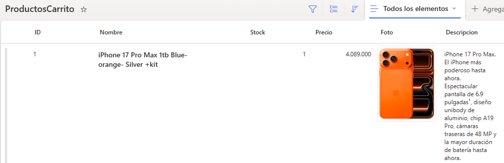
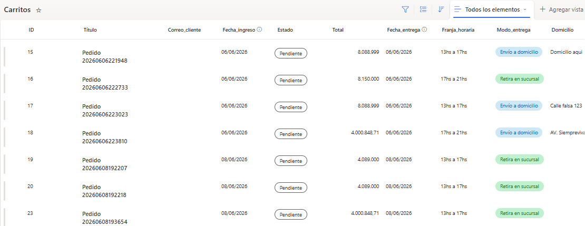
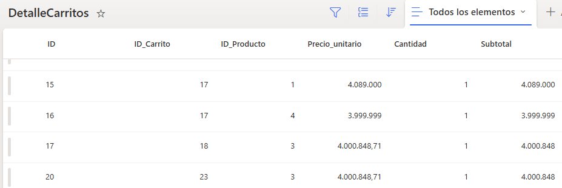
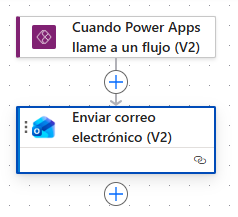

# Sistema de Ventas

Aplicación desarrollada con **Microsoft Power Apps**, **SharePoint Online** y **Power Automate** para gestionar el proceso completo de compra de productos tecnológicos.

# Contenido

- [Descripción](#descripción)
- [Objetivos](#objetivos)
- [Caso de negocio](#caso-de-negocio)
- [Tecnologías utilizadas](#tecnologías-utilizadas)
- [Arquitectura](#arquitectura)
- [Documentación](#documentación)
- [Conceptos aplicados](#conceptos-aplicados)
- [Estado del proyecto](#estado-del-proyecto)
- [Autor](#autor)

---

# Descripción

**TechSupplies Minorista** es una aplicación desarrollada con Microsoft Power Platform que simula un sistema de ventas para una tienda de tecnología.

La solución permite explorar un catálogo de productos, consultar información detallada, administrar un carrito de compras y registrar pedidos en SharePoint Online.

Una vez confirmada la compra, se ejecuta automáticamente un flujo de **Power Automate** que envía un correo electrónico con el resumen del pedido realizado.

---

# Objetivos

El proyecto fue desarrollado con los siguientes objetivos:

- Gestionar la venta de productos tecnológicos.
- Mostrar un catálogo dinámico de productos.
- Administrar un carrito de compras.
- Validar el stock disponible antes de confirmar la compra.
- Registrar automáticamente los pedidos.
- Automatizar el envío de correos de confirmación.
- Integrar Power Apps, SharePoint Online y Power Automate.
- Aplicar buenas prácticas de diseño e implementación utilizando Power Fx.

---

# Caso de negocio

TechSupplies Minorista representa una tienda dedicada a la comercialización de productos tecnológicos.

La aplicación permite a los clientes consultar el catálogo disponible, agregar productos al carrito y confirmar una compra desde una única interfaz.

Cada pedido realizado se registra automáticamente en SharePoint Online y desencadena un flujo de Power Automate encargado de enviar una confirmación por correo electrónico con el detalle de la compra.

La solución simula un proceso de venta simplificado, integrando distintos componentes de Microsoft Power Platform para automatizar el registro de pedidos y mejorar la experiencia del usuario.

---

# Características principales

- Catálogo de productos.
- Búsqueda dinámica.
- Ordenamiento por nombre, precio y stock.
- Gestión del carrito de compras.
- Control automático de stock.
- Validaciones antes de finalizar la compra.
- Confirmación de acciones mediante ventanas emergentes.
- Registro de pedidos en SharePoint Online.
- Envío automático de correo electrónico mediante Power Automate.
- Diseño orientado a mejorar la experiencia del usuario.

---

# Tecnologías utilizadas

- Microsoft Power Apps
- Power Fx
- SharePoint Online
- Power Automate
- Office 365 Outlook

---

# Capturas de pantalla

## Pantalla de inicio


---

## Catálogo de productos


---

## Detalle del producto


---

## Carrito de compras


---

## Confirmación de compra


---

## Procesando compra


---

## Lista Productos (SharePoint)



---

## Lista Carritos (SharePoint)



---

## Lista DetalleCarritos (SharePoint)



---

## Flujo Power Automate



---

# Arquitectura

```text
Cliente
    │
    ▼
Power Apps
    │
    ▼
Power Fx
    │
    ▼
SharePoint Online
    │
    ├──────────────┐
    ▼              ▼
 Carritos    DetalleCarritos
    │
    ▼
Power Automate
    │
    ▼
Office 365 Outlook
    │
    ▼
Correo de confirmación
```

---

# Documentación

La documentación completa del proyecto se encuentra disponible en:

📄 **documentacion/documentacion.md**

---

# Conceptos aplicados

Durante el desarrollo se implementaron los principales conceptos de Microsoft Power Platform:

- Variables globales.
- Variables de contexto.
- Colecciones.
- Formularios.
- Navegación entre pantallas.
- Controles modernos.
- Manipulación de datos mediante Power Fx.
- Operaciones CRUD utilizando Patch.
- Procesamiento de colecciones mediante ForAll.
- Integración entre Power Apps, SharePoint Online y Power Automate.
- Automatización mediante Power Automate.
- Validación de datos.
- Diseño orientado a la experiencia de usuario (UX).

---

# Estado del proyecto

🟢 Proyecto finalizado.

La solución integra Microsoft Power Apps, SharePoint Online y Power Automate para administrar el proceso completo de compra de productos, desde la selección del catálogo hasta el envío automático de la confirmación por correo electrónico.

---

# Autor

**Andrea Natalia Tello**

- GitHub: [AnNaTe07](https://github.com/AnNaTe07)
- LinkedIn: [Andrea Natalia Tello](https://www.linkedin.com/in/andrea-natalia-tello-623874325/)
