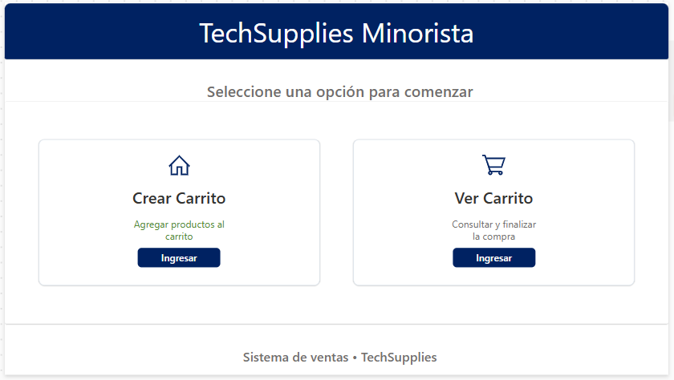
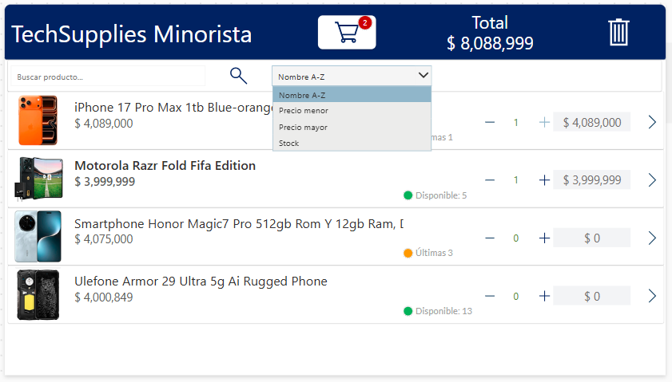
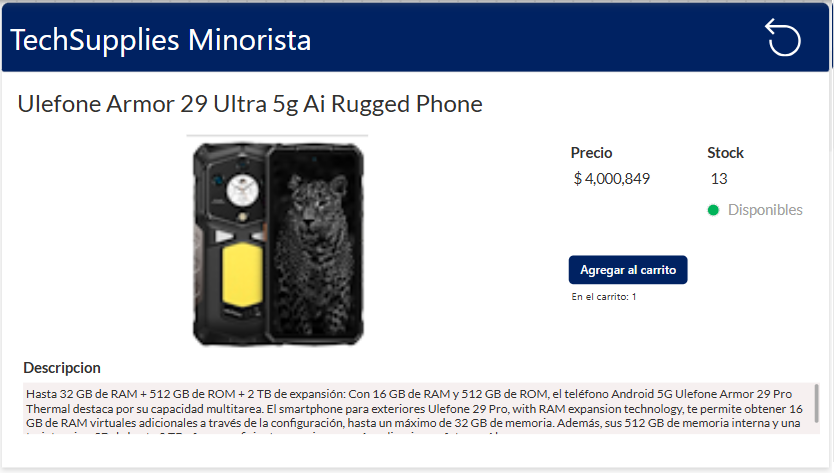
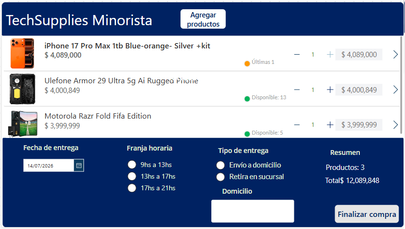
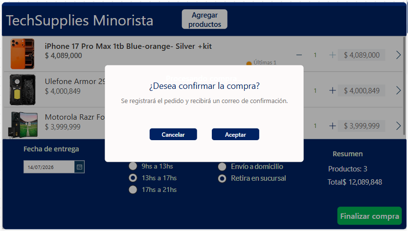
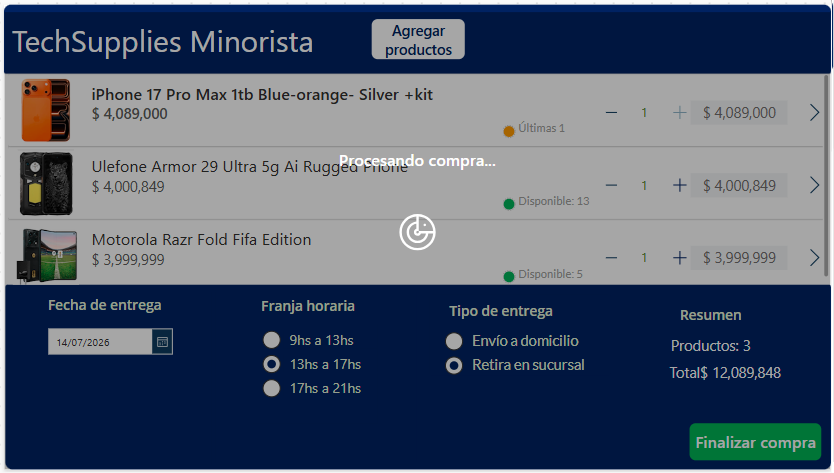

# Sistema de Ventas

Aplicación desarrollada con **Microsoft Power Apps**, utilizando **SharePoint Online** como origen de datos y **Power Automate** para automatizar el envío de confirmaciones de compra.

---

# Descripción del proyecto

**TechSupplies Minorista** es una aplicación desarrollada con Microsoft Power Platform que simula un proceso completo de compra de productos tecnológicos.

La solución permite a los usuarios explorar un catálogo de productos, consultar información detallada, administrar un carrito de compras y registrar pedidos en SharePoint Online.

Una vez finalizada la compra, se ejecuta automáticamente un flujo de **Power Automate** que envía un correo electrónico con la confirmación del pedido.

---

# Capturas de la aplicación

## Pantalla de inicio



---

## Catálogo de productos



---

## Detalle del producto



---

## Carrito de compras



---

## Confirmación de compra



---

## Procesando compra



---

# Objetivos del proyecto

Durante el desarrollo se buscó implementar un flujo de compra similar al utilizado en plataformas de comercio electrónico, aplicando los principales conceptos de Microsoft Power Platform.

Los objetivos funcionales fueron:

- Mostrar un catálogo de productos.
- Permitir consultar información detallada de cada artículo.
- Gestionar un carrito de compras dinámico.
- Controlar el stock disponible.
- Validar los datos necesarios para completar la compra.
- Registrar pedidos utilizando SharePoint Online.
- Registrar el detalle de cada pedido.
- Automatizar el envío de correos electrónicos mediante Power Automate.
- Mejorar la experiencia de usuario mediante una interfaz intuitiva.

---

# Caso de negocio

TechSupplies Minorista comercializa productos tecnológicos a través de un sistema de ventas digital.

La empresa necesitaba una aplicación que permitiera a los clientes consultar el catálogo disponible, seleccionar productos, administrar un carrito de compras y generar pedidos de forma sencilla.

Además, se buscó automatizar el registro de la información y el envío de una confirmación de compra, reduciendo tareas manuales y mejorando la experiencia del usuario.

---

# Tecnologías utilizadas

| Tecnología | Función |
|------------|---------|
| Microsoft Power Apps | Desarrollo de la aplicación |
| SharePoint Online | Almacenamiento de datos |
| Power Automate | Automatización del envío de correos |
| Office 365 Outlook | Envío de confirmaciones |
| Power Fx | Lógica de negocio |
| Colecciones | Gestión del carrito de compras |
| Variables globales y de contexto | Administración del estado de la aplicación |

---

# Arquitectura de la solución

```text
Cliente
    │
    ▼
Power Apps
    │
    ▼
Power Fx
    │
    ▼
 SharePoint Online
    │
    ├──────────────┐
    ▼              ▼
 Carritos    DetalleCarritos
    │
    ▼
Power Automate
    │
    ▼
Office 365 Outlook
    │
    ▼
Correo de confirmación
```

La aplicación utiliza SharePoint como origen de datos para almacenar los pedidos y sus detalles, mientras que Power Automate se encarga de enviar automáticamente la confirmación de compra al cliente.

---

# Modelo de datos

## Lista Productos

| Campo | Tipo | Descripción |
|--------|------|-------------|
| Título | Texto | Nombre del producto |
| Descripción | Texto | Información del producto |
| Precio | Moneda | Precio unitario |
| Stock | Número | Cantidad disponible |
| Imagen | Imagen | Imagen del producto |

---

## Lista Carritos

| Campo | Tipo | Descripción |
|--------|------|-------------|
| Título | Texto | Identificador del pedido |
| Correo_cliente | Texto | Cliente que realiza la compra |
| Fecha_ingreso | Fecha | Fecha del pedido |
| Estado | Opción | Estado del pedido |
| Total | Moneda | Importe total |
| Modo_entrega | Opción | Retiro o envío |
| Fecha_entrega | Fecha | Fecha seleccionada |
| Franja_horaria | Texto | Horario elegido |
| Domicilio | Texto | Dirección de entrega |

---

## Lista DetalleCarritos

| Campo | Tipo | Descripción |
|--------|------|-------------|
| ID_Carrito | Número | Pedido asociado |
| ID_Producto | Número | Producto adquirido |
| Cantidad | Número | Cantidad solicitada |
| Precio_unitario | Moneda | Precio del producto |
| Subtotal | Moneda | Importe parcial |

---

# Flujo de funcionamiento

```text
Inicio
    │
    ▼
Catálogo de productos
    │
    ▼
Agregar productos al carrito
    │
    ▼
Carrito de compras
    │
    ▼
Validaciones
    │
    ▼
Confirmar compra
    │
    ▼
Guardar pedido en SharePoint
    │
    ▼
Guardar detalle del pedido
    │
    ▼
Ejecutar Power Automate
    │
    ▼
Enviar correo electrónico
    │
    ▼
Compra finalizada
```

---

# Pantallas de la aplicación

## Inicio

Permite acceder rápidamente a las principales funcionalidades de la aplicación:

- Crear carrito.
- Ver carrito.

---

## Catálogo

Permite consultar todos los productos disponibles.

Funcionalidades implementadas:

- Listado dinámico desde SharePoint.
- Búsqueda por nombre.
- Ordenamiento por nombre.
- Ordenamiento por precio ascendente.
- Ordenamiento por precio descendente.
- Ordenamiento por stock.
- Indicadores visuales de stock.
- Acceso al detalle del producto.
- Agregado directo al carrito.
- Actualización automática del total.
- Badge dinámico con la cantidad de productos.

---

## Detalle del producto

Permite visualizar información ampliada del artículo seleccionado.

Se muestra:

- Imagen.
- Nombre.
- Descripción.
- Precio.
- Stock disponible.

Desde esta pantalla también es posible agregar productos al carrito.

Cuando el producto ya fue agregado:

- Se informa la cantidad seleccionada.
- El botón se deshabilita automáticamente al alcanzar el stock máximo.

---

## Carrito

Centraliza toda la información necesaria para completar la compra.

Permite:

- Modificar cantidades.
- Eliminar productos.
- Consultar el importe total.
- Seleccionar modalidad de entrega.
- Elegir fecha de entrega.
- Seleccionar franja horaria.
- Ingresar domicilio cuando corresponde.

También incorpora un panel de resumen con:

- Cantidad total de productos.
- Importe total del pedido.

---

# Variables principales

| Variable | Tipo | Función |
|----------|------|---------|
| coll_Carrito | Colección | Productos agregados al carrito |
| var_registro | Global | Producto seleccionado para visualizar el detalle |
| var_Carrito | Global | Pedido generado en SharePoint |
| ctxConfirmarCompra | Contexto | Controla el popup de confirmación |
| ctxConfirmarVaciar | Contexto | Controla el popup para vaciar el carrito |
| ctxCargando | Contexto | Muestra la pantalla de procesamiento durante la compra |

# Funcionalidades implementadas

## Gestión del catálogo

La aplicación permite consultar el catálogo completo de productos almacenados en SharePoint Online.

Se implementaron las siguientes funcionalidades:

- Visualización dinámica de productos.
- Consulta del detalle de cada artículo.
- Búsqueda por nombre.
- Ordenamiento por nombre.
- Ordenamiento por precio ascendente.
- Ordenamiento por precio descendente.
- Ordenamiento por stock.
- Actualización automática del contador del carrito.

---

## Gestión del carrito

El carrito de compras se administra mediante una colección local.

Cada modificación actualiza automáticamente:

- Cantidad de productos.
- Subtotales.
- Importe total del pedido.

Cuando la cantidad de un producto llega a cero, el artículo se elimina automáticamente del carrito.

---

## Control de stock

La aplicación controla que nunca puedan agregarse más unidades de las disponibles.

Para mejorar la experiencia del usuario se implementaron indicadores visuales del estado del stock:

- **Disponible**
- **Últimas unidades**
- **Sin stock**

Cada estado posee un color distintivo que facilita su identificación.

Cuando un producto alcanza el límite disponible:

- El botón para incrementar la cantidad queda deshabilitado.
- Se informa visualmente que no existe stock disponible.

---

## Validaciones

Antes de registrar la compra la aplicación verifica que:

- Exista al menos un producto en el carrito.
- Se seleccione el tipo de entrega.
- Se indique una fecha de entrega.
- Se seleccione una franja horaria.
- Se ingrese un domicilio cuando la modalidad seleccionada sea **Envío a domicilio**.

Mientras alguno de estos requisitos no se cumpla, el botón **Finalizar compra** permanece deshabilitado.

---

## Confirmaciones

Para evitar acciones accidentales se incorporaron ventanas de confirmación antes de ejecutar operaciones críticas.

### Vaciar carrito

Solicita confirmación antes de eliminar todos los productos seleccionados.

### Confirmar compra

Solicita confirmación antes de registrar definitivamente el pedido.

---

## Indicador de procesamiento

Durante el registro de la compra se muestra una pantalla de procesamiento.

Mientras se ejecutan las operaciones de almacenamiento y envío del correo electrónico, la interfaz bloquea nuevas acciones del usuario mostrando el mensaje **"Procesando compra..."**.

Esto evita múltiples envíos del mismo pedido.

---

## Persistencia de datos

La información del pedido se almacena utilizando listas de SharePoint Online.

Se registra:

- Información general del pedido.
- Detalle de los productos comprados.
- Cantidades.
- Precios.
- Subtotales.
- Total de la compra.
- Modalidad de entrega.
- Fecha de entrega.
- Franja horaria.
- Domicilio.

---

# Integración con Power Automate

Una vez registrado el pedido, la aplicación ejecuta automáticamente un flujo desarrollado en **Power Automate**.

El flujo utiliza **Office 365 Outlook** para enviar un correo electrónico al cliente con la confirmación de la compra y el resumen del pedido realizado.

---

# Diseño de interfaz

Durante el desarrollo se realizaron mejoras orientadas a optimizar la experiencia de usuario.

Entre ellas se destacan:

- Organización mediante contenedores.
- Encabezado moderno con navegación simplificada.
- Tarjetas para la presentación de productos.
- Indicadores visuales de stock.
- Badge dinámico para el carrito.
- Panel de resumen del pedido.
- Formularios organizados por secciones.
- Popups de confirmación.
- Pantalla de procesamiento durante la compra.
- Diseño uniforme utilizando la tipografía Segoe UI.

---

# Decisiones de diseño

Durante el desarrollo se adoptaron distintos criterios para mejorar la usabilidad de la aplicación.

Entre ellos:

- El carrito mantiene su contenido mientras la compra no sea finalizada.
- El usuario no puede superar el stock disponible.
- Las acciones críticas requieren confirmación.
- El botón **Finalizar compra** permanece deshabilitado hasta cumplir todas las validaciones.
- El domicilio únicamente es obligatorio cuando la modalidad seleccionada es **Envío a domicilio**.
- Durante el procesamiento del pedido se bloquea la interacción para evitar múltiples envíos.

---

# Características destacadas

La aplicación incorpora diversas funcionalidades orientadas a mejorar la experiencia de compra y facilitar la interacción del usuario.

Entre las principales características se encuentran:

- Interfaz organizada mediante contenedores.
- Catálogo de productos con búsqueda dinámica.
- Ordenamiento por nombre, precio y stock.
- Indicadores visuales del estado del stock.
- Control automático de disponibilidad de productos.
- Gestión dinámica del carrito de compras.
- Panel de resumen del pedido.
- Validaciones antes de finalizar la compra.
- Ventanas de confirmación para acciones críticas.
- Pantalla de procesamiento durante el registro del pedido.
- Integración con SharePoint Online para el almacenamiento de la información.
- Envío automático de correos electrónicos mediante Power Automate.
- Código organizado utilizando nombres descriptivos para controles, variables y pantallas.

---

# Conceptos aplicados

Durante el desarrollo se implementaron los principales conceptos de Microsoft Power Platform:

- Variables globales.
- Variables de contexto.
- Colecciones.
- Navegación entre pantallas.
- Formularios.
- Controles modernos.
- Manipulación de datos mediante Power Fx.
- Operaciones CRUD utilizando Patch.
- Procesamiento de colecciones mediante ForAll.
- Integración entre Power Apps, SharePoint Online y Power Automate.
- Automatización del envío de correos electrónicos.
- Validación de datos.
- Diseño orientado a la experiencia de usuario (UX).

---

# Conclusión

El desarrollo del Sistema de Ventas permitió implementar un flujo completo de compra utilizando Microsoft Power Platform.

La solución integra Power Apps, SharePoint Online y Power Automate para administrar el catálogo de productos, gestionar el carrito de compras, registrar pedidos y automatizar el envío de confirmaciones por correo electrónico.

Durante el proyecto se aplicaron conceptos como navegación entre pantallas, colecciones, variables globales y de contexto, validaciones, operaciones CRUD mediante Power Fx e integración con servicios de Microsoft 365, obteniendo una aplicación funcional, organizada y orientada a mejorar la experiencia del usuario.
